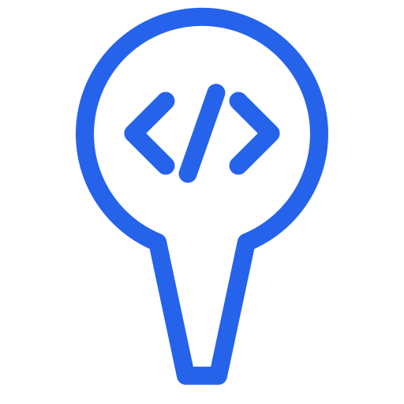

<div align="center">
  
  <h1>tegakari</h1>
</div>

<div align="center">

**English** | [日本語](./README.ja.md)

[](https://chromewebstore.google.com/detail/tegakari/phobgclkkcnkmmfnmloganoefjifnidp)
[](https://github.com/iemong/tegakari/actions/workflows/ci.yml)
[](LICENSE)

</div>

A Chrome extension that lets you select elements on any web page and capture their context (element info, framework, component hierarchy, and more) as Markdown or JSONL.

Copy the generated text to your clipboard and paste it straight into AI editors like Claude Code or Cursor.


## Features

- 🧩 **Agent Skills included** — install with `gh skill` so agents like Claude Code can work with tegakari's settings and output intelligently. See [`skills/README.md`](skills/README.md)
- Click multiple elements on a page to select and annotate them
- Move the selection up/down the DOM tree with `\` (or `↑` / `↓`) to reach elements that are hard to hover directly
- Select elements inside same-origin iframes too (opt-in via Options — handy for iframe-rendered pages like Google Apps Script web apps)
- Annotate the right-clicked element straight from the "tegakari: この要素を選択" context-menu item (top frame only)
- Remembers your output format (JSONL / Markdown) across sessions
- Drop a pin marker on each selected element and enter an instruction in the popover next to it
- Auto-capture a screenshot when you click an element (cropped around the element)
- Grab the element's HTML info (tag, attributes, text)
- Capture the element's effective styles (a computed-style diff vs. tag defaults) so AI can answer "tighten this spacing / change this color" with real values
- Auto-detect React / Vue component hierarchy, props, and state
- Resolve the component's source location (`file:line`) into the output when available (dev builds)
- Detect meta-frameworks such as Next.js / Nuxt
- Collect page metadata (viewport, user agent, language) and include it in the output
- Switch between JSONL / Markdown and copy to the clipboard
- Copy all annotation screenshots as a single contact-sheet image
- Export / import annotation sets as a timestamped JSON file (`tegakari-annotations-*.json`) to share or back them up
- Per-URL-pattern prefix settings (e.g. `[repo=my-app]`)
- Persist annotations per URL (up to 50, restored after a page reload)
- Archive management for annotations (Active / Archived)
- Dark / Light theme support

## Installation

### From the Chrome Web Store (recommended)

Install it from the Chrome Web Store:

<a href="https://chromewebstore.google.com/detail/tegakari/phobgclkkcnkmmfnmloganoefjifnidp" target="_blank">
  
</a>

### Build from source and load it

1. Clone this repository

   ```bash
   git clone https://github.com/iemong/tegakari.git
   cd tegakari
   pnpm install
   pnpm build
   ```

2. Open `chrome://extensions` in Chrome

3. Enable "Developer mode" in the top right

4. Click "Load unpacked"

5. Select the `build/chrome-mv3-prod` folder inside the cloned repository

## Usage

1. Click the extension icon on any web page (the cursor turns into a crosshair)
   - You can also toggle it with the keyboard shortcut `Ctrl+Shift+Y` (`Command+Shift+Y` on Mac). Rebind it from `chrome://extensions/shortcuts`
2. Hover over the element you want to inspect to highlight it
   - If you can't land on the exact element, press `\` (or `↑`) to move the highlight up to the parent, or `↓` to move back down to a child. Once it's on the right element, confirm with `Enter` (or just click)
3. Click the element to drop a pin marker and open a popover
4. Enter an instruction in the popover and save with **Save** or `Cmd+Enter`
5. Keep clicking elements to annotate several at once
6. Use the toolbar at the bottom of the screen:
   - **Inbox**: show the annotation list (Active / Archived tabs)
   - **Copy**: copy all annotations to the clipboard
   - **Copy Image**: copy all annotation screenshots as a single contact-sheet image
   - **JSONL / MD**: switch the output format
   - **Theme toggle**: dark / light mode
   - **Settings**: manage prefix rules (Options page)
7. Each item in the Inbox has a copy button (single copy) and an archive button
8. Use the import / export buttons in the Inbox to save the annotation set as a JSON file (`tegakari-annotations-*.json`) and restore it later
9. Paste it into your AI editor and put it to work
10. Press `Esc` to close the toolbar (annotations are kept)

### Prefix settings

Open the Options page from the settings icon (⚙) in the toolbar to configure a prefix per URL pattern.

- **Host match**: `localhost:3000` → applied automatically on that host
- **Regex match**: `https?://staging\.example\.com/.*` → matched against the full URL
- Rules are evaluated top to bottom, and the first match wins

The configured prefix is prepended to the output when you copy.

### Selecting elements inside iframes

Enable "Select inside iframes" under the **Behavior** section of the Options page to also pick elements inside **same-origin iframes**. This is useful for giving feedback on pages that render their content in an iframe, such as Google Apps Script web apps.

- Off by default (not needed on ordinary pages)
- **Cross-origin iframes** can't be accessed due to browser security and are not selectable
- iframes nested inside another iframe are not covered (single level only)
- Framework/component collection is skipped for iframe elements (element info and screenshots are still captured)

If you are not comfortable with regular expressions, the [`tegakari-prefix-rules` skill](skills/tegakari-prefix-rules/SKILL.md) — installable via `gh skill` — generates the import JSON interactively: just answer which URLs your app runs on and the repository name. See [`skills/README.md`](skills/README.md) for details.

## Output examples

### Markdown format

```markdown
[repo=my-app]

## Page Context
- **URL**: https://example.com/dashboard/settings
- **Framework**: React
- **Meta Framework**: Next.js (App Router)
- **Page Title**: Settings | Example App
- **Viewport**: 1920x1080
- **Language**: en
- **User Agent**: Mozilla/5.0 ...

## Annotation #1
**Instruction**: When this save button is clicked, show a confirm dialog
- **Selector**: `#settings-form > div:nth-child(2) > button.btn-primary`
- **Tag**: `<button>`
- **Text**: "Save"
- **Attributes**:
  - class: `btn btn-primary px-4 py-2`
  - data-testid: `settings-submit-btn`
  - type: `submit`
- **Styles**:
  - padding: `8px 16px`
  - border-radius: `8px`
  - background-color: `rgb(37, 99, 235)`
  - color: `rgb(255, 255, 255)`
- **Component**: `SettingsPage` → `SettingsForm` → `SubmitButton`
- **Source**: `src/components/SubmitButton.tsx:42`
- **Props**: `{ variant: "primary", disabled: false, onClick: fn }`
- **State**: `{ isSubmitting: false }`
```

### JSONL format (default)

```jsonl
{"type":"prefix","content":"[repo=my-app]"}
{"type":"pageContext","url":"https://example.com/dashboard/settings","pageTitle":"Settings | Example App","framework":"React","metaFramework":"Next.js (App Router)","viewport":"1920x1080","language":"en","userAgent":"Mozilla/5.0 ..."}
{"type":"annotation","id":1,"instruction":"When this save button is clicked, show a confirm dialog","element":{"selector":"#settings-form > div:nth-child(2) > button.btn-primary","tag":"button","text":"Save","attributes":{"class":"btn btn-primary px-4 py-2","data-testid":"settings-submit-btn","type":"submit"},"styles":{"padding":"8px 16px","border-radius":"8px","background-color":"rgb(37, 99, 235)","color":"rgb(255, 255, 255)"}},"component":{"framework":"react","hierarchy":["SettingsPage","SettingsForm","SubmitButton"],"source":"src/components/SubmitButton.tsx:42","props":{"variant":"primary","disabled":false,"onClick":"fn"},"state":{"isSubmitting":false}}}
```

## Supported frameworks

| Framework | What's detected |
|---|---|
| React | Component hierarchy, props, state (Hooks) |
| Vue 2 / 3 | Component hierarchy, props, data |
| Next.js | App Router / Pages Router detection |
| Nuxt | Framework detection |

## Development

```bash
pnpm dev        # Development mode (hot reload)
pnpm build      # Production build
pnpm test       # Run tests
pnpm package    # ZIP packaging (for distribution)
```

## Contributing

Bug reports, feature requests, and pull requests are welcome. Small,
focused PRs are preferred over large ones. See [CONTRIBUTING.md](CONTRIBUTING.md)
for the development setup, quality gates, and PR guidelines.

## Support development

tegakari is developed as free and open-source software. If you find it useful,
support via GitHub Sponsors is a great encouragement to keep going 🙏

[](https://github.com/sponsors/iemong)

> If the Sponsor button does not appear, please wait until the GitHub Sponsors
> registration and approval are complete.

## License

[MIT License](LICENSE)
